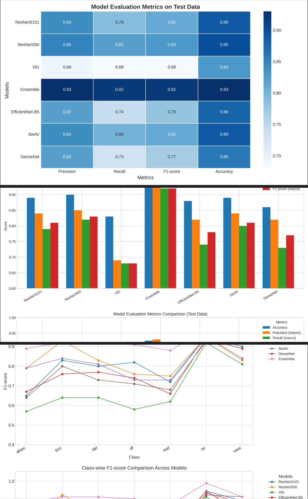

- Leveraged the [HAM10000 dataset](https://dataverse.harvard.edu/dataset.xhtml?persistentId=doi:10.7910/DVN/DBW86T), which contains 10,015 dermatoscopic images categorized into seven classes of pigmented skin lesions:  
  - actinic keratoses and intraepithelial carcinoma/Bowen's disease (**akiec**)  
  - basal cell carcinoma (**bcc**)  
  - benign keratosis-like lesions (**bkl**; including solar lentigines, seborrheic keratoses, and lichen-planus-like keratoses)  
  - dermatofibroma (**df**)  
  - melanoma (**mel**)  
  - melanocytic nevi (**nv**)  
  - vascular lesions (**vasc**; including angiomas, angiokeratomas, pyogenic granulomas, and hemorrhage)  

- Trained and fine-tuned the hyperparameters of four CNN-based models (**DenseNet, EfficientNet-B5, ResNeXt-50, ResNeXt-101**), a contrastive learning-based model (**SwAV**), and a Graph Convolutional Network-based model (**Vision GNN, ViG**) for skin lesion classification, and compared their performance across multiple classification metrics.

- Additionally, implemented and conducted an ablation study on a soft voting ensemble of models — including **SwAV, Vision Transformer (ViT), Multi-Axis Vision Transformer (MaxViT), EfficientNet-B5, Inception-V3, DenseNet-121, ResNeXt-50, ResNeXt-101, and ResNeXt-101 64D** — achieving the highest accuracy.

- **Frameworks/Tools Used:** PyTorch, Plotly, Matplotlib, Weights & Biases, OpenCV.

---

  
   
  <em>Trained models performance comparisons.</em>

